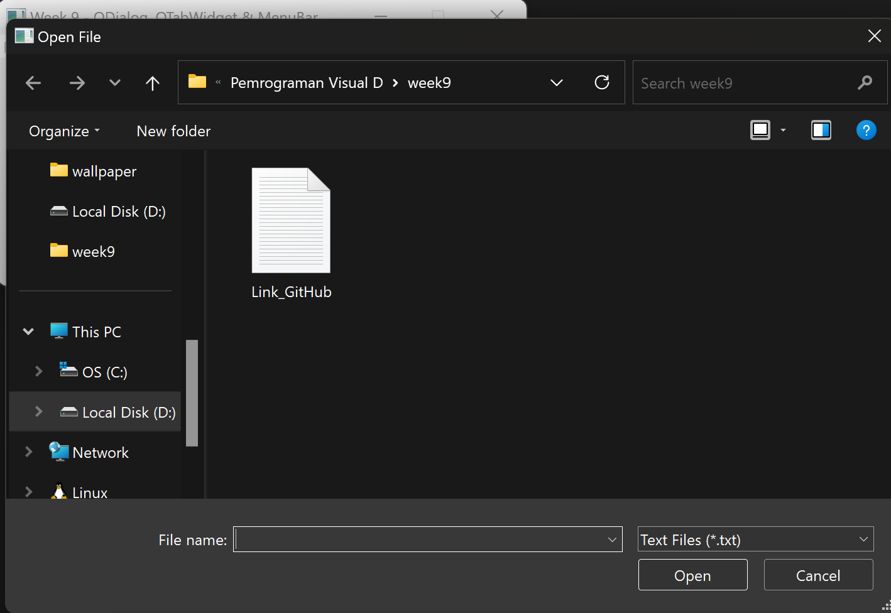

# # Assignment Week 9

<table align="center">
  <tr>
    <td align="center" colspan="2">
       
      <b>Tampilan awal ketika di run.</b>
    </td>
  </tr>
  <tr>
    <td align="center">
       
      <b>Ketika pilih opsi File, ada untuk Keluar dari aplikasi.</b>
    </td>
    <td align="center">
       
      <b>Ketika pilih opsi Fitur, ada ditampilkan fitur yang ada yaitu Input Nama, Pilih Font, dan Buka File.</b>
    </td>
  </tr>
  <tr>
    <td align="center">
       
      <b>Tampilan ketika memasukkan nama dan belum mengklik tombol Input nama.</b>
    </td>
    <td align="center">
       
      <b>Tampilan ketika sesudah mengklik tombol Input nama.</b>
    </td>
  </tr>
  <tr>
    <td align="center">
       
      <b>Tampilan sebelum memilih Font.</b>
    </td>
    <td align="center">
       
      <b>Tampilan sesudah memilih Font.</b>
    </td>
  </tr>
  <tr>
    <td align="center">
       
      <b>Tampilan ketika akan memilih Font yang diinginkan.</b>
    </td>
    <td align="center">
       
      <b>Tampilan ketika sudah memilih Font yang diinginkan dan mengklik Ok.</b>
    </td>
  </tr>
  <tr>
    <td align="center">
       
      <b>Tampilan sebelum membuka File.</b>
    </td>
    <td align="center">
       
      <b>Tampilan sesudah membuka File.</b>
    </td>
  </tr>
  <tr>
    <td align="center">
       
      <b>Tampilan ketika akan memilih File yang ingin dibuka.</b>
    </td>
    <td align="center">
       
      <b>Tampilan ketika sudah memilih File yang ingin dibuka dan mengklik Open.</b>
    </td>
  </tr>
</table>
